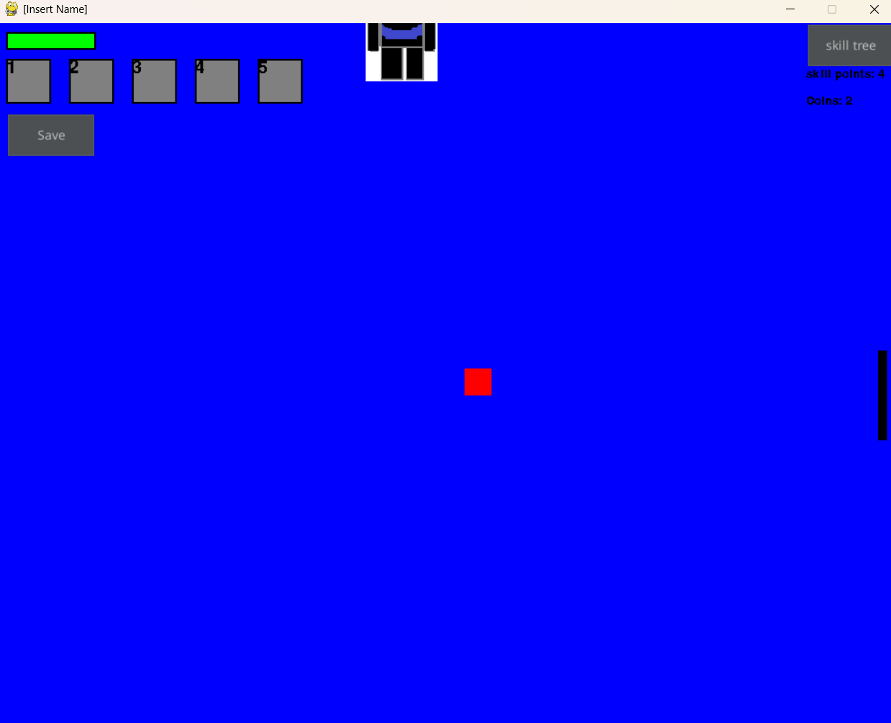

# Dungeon Crawler (OCR NEA A-Level Project)

This is a 2D dungeon crawler game created as part of my A-Level Computer Science NEA project.  
The player traverses through rooms varying in size and enemy count and can collect coins and skill points to upgrade their character. Not all of the game's features are fully finished but this scored me a high mark.

## How to run
1. Install Python 3.11.9
2. (Optional) Create a virtual environment: `python -m venv venv`
3. Activate it (Windows `venv\Scripts\activate`, macOS/Linux `source venv/bin/activate`)
4. Install requirements: `pip install -r requirements.txt`
5. Run: `python main.py`

## Requirements
- Python 3.11.9
- pygame == 2.6.1

## Screenshots

## Controls
- WASD to move
- Left mouse button to attack
- Click Menu button in the top right to pause game

## Author
Mueen Urwah
